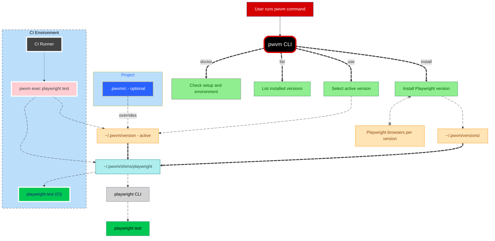

# pwvm


## **Playwright Version Manager**

📦 npm package: https://www.npmjs.com/package/pwvm

An open-source **Playwright Version Manager (pwvm)**.


---

## What pwvm is ?

`pwvm` or **Playwright Version Manager** lets you *install, manage, and switch between multiple Playwright versions* with a single command — similar to how `nvm` works for Node.js.

It is designed for **reproducible local development and CI environments**, where Playwright versions and browser binaries must stay in sync.

---

## Why it exists

Playwright evolves quickly, which is great — but upgrades and breaking changes can unintentionally disrupt local setups and CI pipelines.

`pwvm` keeps Playwright versions **isolated, predictable, and easy to switch**, so upgrades happen on *your* schedule, not in the middle of your workflow.

---

## Support pwvm

`pwvm` is built and maintained independently to solve a problem many of us face but rarely have time to fix properly.

If `pwvm` helps you or your team avoid broken builds, unstable upgrades, or wasted CI hours, please consider supporting its development by **starring the project ⭐️**, sharing it with others, or contributing.

Your support helps keep pwvm reliable, maintained, and moving forward.

---

## Installation

### Global installation (recommended)

```sh
npm install -g pwvm
```

Verify:
```sh
pwvm --version
```

### One-time setup
```sh
pwvm setup
```

This prints the PATH export needed for Playwright shims.

> [!NOTE]  
> **What are shims?** <br>
> Shims are small executable files that act as stable entry points to the currently selected Playwright version.

> [!WARNING]
> Make sure to add the printed PATH entry to your shell config (`~/.bashrc`, `~/.zshrc`, etc.):

```sh
export PATH="$HOME/.pwvm/shims:$PATH"
```

Restart your shell or reload the config.

## How pwvm works



### Common commands

```sh
# List installed Playwright versions
pwvm list

# Install a Playwright version (browsers installed by default)
pwvm install 1.57.0

# Skip browser download
pwvm install 1.57.0 --no-browsers

# Set the active Playwright version globally
pwvm use 1.57.0

# Show the currently active version
pwvm current

# Remove unused versions
pwvm prune

# Diagnose setup issues
pwvm doctor
```

After setup, use Playwright normally:

```sh
# VYou can verify the actual Playwright version in use currently
playwright --version # or playwright -V

# Run test as usual (can be your own commands with multiple params)
playwright test
```

### Project-level version pinning (`.pwvmrc`)

You can pin a Playwright version per project using a `.pwvmrc` file.

Create `.pwvmrc` in your project root:

```text
1.57.0
```

When present:

- `.pwvmrc` overrides the global version
- No need to run `pwvm use` inside that project
- Ideal for CI, monorepos, and shared repositories

## Running pwvm in Docker

You can use `pwvm` in Docker to manage and test multiple Playwright versions.

#### Example Dockerfile

```Dockerfile
FROM node:20-slim

# Install pwvm globally
RUN npm install -g pwvm

# Root default
ENV PATH="/root/.pwvm/shims:${PATH}"

WORKDIR /app
COPY . .

# Uncomment to install multiple Playwright versions using RUN commands
RUN pwvm install 1.57.0 --no-browsers
# RUN pwvm install 1.40.0
# RUN pwvm install latest

CMD ["sh"]
```

#### Build and run

```sh
# Build the Docker image
docker build -t pwvm .

# Run tests with a specific version
docker pwvm use 1.57.0
```

#### Verify installed versions

```sh
# List all installed versions
docker run pwvm list
```

#### docker interactive mode (shell)
```sh
docker run -it pwvm
```

Then use commands like you would run on your local


> [!NOTE] pwvm performs no background network activity and only installs software when explicitly requested.

### Usage in CI pipelines

`pwvm` is CI-friendly by design:

- no shell profile dependency
- explicit PATH control
- deterministic install locations
- predictable browser downloads

### General CI pattern

- Install `pwvm`
- Run `pwvm setup`
- Add `~/.pwvm/shims` to `PATH`
- Install and select a specific Playwright version
- Run Playwright commands

## Pipleine examples (`yaml`)

### GitHub Actions

```yaml
- uses: actions/setup-node@v4
  with:
    node-version: 20

- run: npm install -g pwvm
- run: pwvm setup
- run: echo "$HOME/.pwvm/shims" >> $GITHUB_PATH
- run: pwvm install 1.57.0
- run: pwvm use 1.57.0
- run: playwright test
```


### Azure Pipelines

```yaml
- task: NodeTool@0
  inputs:
    versionSpec: "20.x"

- script: npm install -g pwvm
- script: pwvm setup
- script: |
    export PATH="$HOME/.pwvm/shims:$PATH"
    pwvm install 1.57.0
    pwvm use 1.57.0
    playwright test
```


### Bitbucket Pipelines

```yaml
script:
  - npm install -g pwvm
  - pwvm setup
  - export PATH="$HOME/.pwvm/shims:$PATH"
  - pwvm install 1.57.0
  - pwvm use 1.57.0
  - playwright test
```

### Browser installation behavior

- Browsers are installed per Playwright version

- By default, `pwvm install` installs browsers

> [!TIP]
> Use `--no-browsers` to explicitly skip downloads

This keeps installs predictable and CI-friendly.

## Contributing

See [CONTRIBUTING](CONTRIBUTING.md)