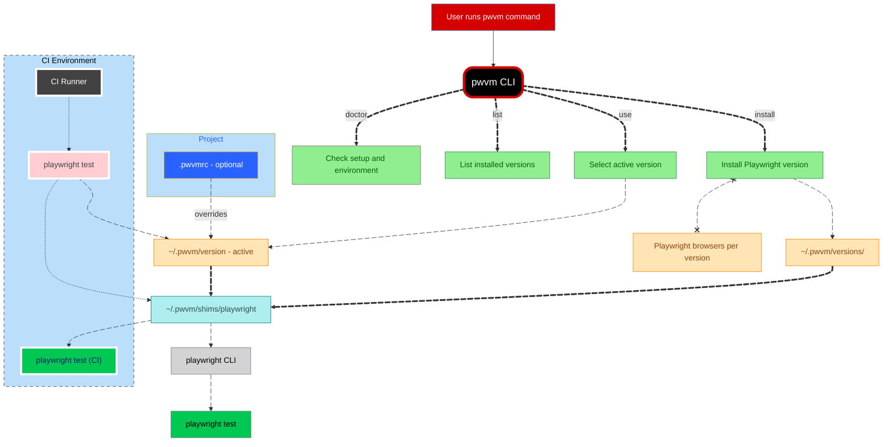

# pwvm

 [](https://www.npmjs.com/package/pwvm)

## **Playwright Version Manager**

📦 npm package: https://www.npmjs.com/package/pwvm

An open-source **Playwright Version Manager (pwvm)**.


---

## What is pwvm?

`pwvm` or **Playwright Version Manager** lets you *install, manage, and switch between multiple Playwright versions* with a single command — similar to how `nvm` works for Node.js.

It is designed for **reproducible local development and CI environments**, where Playwright versions and browser binaries must stay in sync.

---

## Why it exists

Playwright evolves quickly, which is great — but upgrades and breaking changes can unintentionally disrupt local setups and CI pipelines.

`pwvm` keeps Playwright versions **isolated, predictable, and easy to switch**, so upgrades happen on *your* schedule, not in the middle of your workflow.

---

## Support pwvm

`pwvm` is built and maintained independently to solve a problem many of us face but rarely have time to fix properly.

If `pwvm` helps you or your team avoid broken builds, unstable upgrades, or wasted CI hours, please consider supporting its development by **starring the project ⭐️**, sharing it with others, or contributing.

Your support helps keep pwvm reliable, maintained, and moving forward.

---

## Installation

### Global installation (recommended)

```sh
npm install -g pwvm
```

Verify:
```sh
pwvm --version
```

### One-time setup
```sh
pwvm setup
```

This creates the Playwright shims and prints the PATH export needed to use them.

> [!NOTE]  
> **What are shims?** <br>
> Shims are small executable files that act as stable entry points to the currently selected Playwright version.

> [!WARNING]
> Make sure to add the printed PATH entry to your shell config (`~/.bashrc`, `~/.zshrc`, etc.):

```sh
export PATH="$HOME/.pwvm/shims:$PATH"
```

Restart your shell or reload the config.

## How pwvm works


```mermaid
flowchart TB
 subgraph Project["Project"]
        RC[".pwvmrc - optional"]
  end
 subgraph CIEnv["CI Environment"]
        CI["CI Runner"]
        CI_CMD["playwright test"]
        CI_Tests["playwright test (CI)"]
  end
    User["User runs pwvm command"] --> Cmd["pwvm CLI"]
    Cmd L_Cmd_Install_0@== install ==> Install["Install Playwright version"]
    Cmd L_Cmd_Use_0@== use ==> Use["Select active version"]
    Cmd L_Cmd_List_0@== list ==> List["List installed versions"]
    Cmd L_Cmd_Doctor_0@== doctor ==> Doctor["Check setup and environment"]
    Install L_Install_VersionsDir_0@--> VersionsDir["~/.pwvm/versions/"]
    Install L_Install_Browsers_0@x--x Browsers["Playwright browsers per version"]
    Use L_Use_Active_0@-.-> Active["~/.pwvm/version - active"]
    Active L_Active_Shims_0@==> Shims["~/.pwvm/shims/playwright"]
    VersionsDir L_VersionsDir_Shims_0@==> Shims
    Shims L_Shims_PlaywrightCLI_0@--> PlaywrightCLI["playwright CLI"]
    PlaywrightCLI L_PlaywrightCLI_Tests_0@--> Tests["playwright test"]
    RC L_RC_Active_0@-- overrides --> Active
    CI -.-> CI_CMD
    CI_CMD L_CI_CMD_Active_0@-.-> Active & Shims
    Shims L_Shims_CI_Tests_0@-.-> CI_Tests

    Cmd@{ shape: rounded}
     RC:::config
     CI:::ci
     CI_CMD:::ci
     CI_Tests:::ci
     User:::user
     Cmd:::cli
     Install:::command
     Use:::command
     List:::command
     Doctor:::command
     VersionsDir:::fs
     Browsers:::fs
     Active:::fs
     Shims:::shim
     PlaywrightCLI:::exec
     Tests:::exec
    classDef user fill:lightblue,stroke:steelblue,color:midnightblue
    classDef cli fill:black,stroke:purple,color:white
    classDef command fill:lightgreen,stroke:seagreen,color:darkgreen
    classDef fs fill:moccasin,stroke:darkorange,color:saddlebrown
    classDef shim fill:paleturquoise,stroke:teal,color:darkslategray
    classDef exec fill:lightgray,stroke:slategray,color:black
    classDef config fill:lemonchiffon,stroke:goldenrod,color:darkgoldenrod
    classDef ci fill:aliceblue,stroke:steelblue,color:midnightblue,stroke-dasharray:5 5
    style RC fill:#2962FF,color:#FFFFFF
    style CI fill:#424242,color:#FFFFFF,stroke:#FFFFFF,stroke-width:4px,stroke-dasharray: 0
    style CI_CMD color:#424242,fill:#FFCDD2,stroke:#FFFFFF,stroke-width:4px,stroke-dasharray: 0
    style CI_Tests fill:#00C853,stroke-width:4px,stroke-dasharray: 0,stroke:#FFFFFF
    style User color:#FFFFFF,fill:#D50000
    style Cmd rx:18,ry:18,padding:18px,font-size:20px,stroke-width:5px,stroke:#D50000
    style Doctor stroke:#757575
    style Tests fill:#00C853
    style CIEnv fill:#BBDEFB,stroke:#424242,stroke-dasharray:6 6,color:#000000
    style Project fill:#BBDEFB,color:#2962FF

    L_Cmd_Install_0@{ animation: slow } 
    L_Cmd_Use_0@{ animation: slow } 
    L_Cmd_List_0@{ animation: slow } 
    L_Cmd_Doctor_0@{ animation: slow } 
    L_Install_VersionsDir_0@{ animation: slow } 
    L_Install_Browsers_0@{ animation: slow } 
    L_Use_Active_0@{ animation: slow } 
    L_Active_Shims_0@{ animation: slow } 
    L_VersionsDir_Shims_0@{ animation: fast } 
    L_Shims_PlaywrightCLI_0@{ animation: slow } 
    L_PlaywrightCLI_Tests_0@{ animation: fast } 
    L_RC_Active_0@{ animation: slow } 
    L_CI_CMD_Active_0@{ curve: natural, animation: slow } 
    L_Shims_CI_Tests_0@{ animation: slow }
```

### Common commands

```sh
# List installed Playwright versions
pwvm list

# Install a Playwright version (browsers installed by default)
pwvm install 1.57.0

# Skip browser download
pwvm install 1.57.0 --no-browsers

# Set the active Playwright version globally
pwvm use 1.57.0

# Or use the version from .pwvmrc in the current project
pwvm use

# Show the currently active version
pwvm current

# Remove unused versions
pwvm prune

# Diagnose setup issues
pwvm doctor
```

After setup, use Playwright normally:

```sh
# You can verify the actual Playwright version currently in use
playwright --version # or playwright -V

# Run test as usual (can be your own commands with multiple params)
playwright test
```

### Project-level version pinning (`.pwvmrc`)

You can pin a Playwright version per project using a `.pwvmrc` file.

Create `.pwvmrc` in your project root:

```text
1.57.0
```

When present:

- `.pwvmrc` overrides the global version
- Running `playwright ...` in that project uses the pinned version automatically
- Running `pwvm use` with no version will select the version from `.pwvmrc`
- Ideal for CI, monorepos, and shared repositories

## Running pwvm in Docker

`pwvm` works in Docker, and you can also verify that locally with the repo's Docker demo flow or use it for working demos.

Docker is especially useful when you want to:

- cache multiple Playwright versions in one controlled environment
- switch versions quickly with `pwvm use`
- prove that plain `playwright` commands resolve through pwvm naturally
- validate pwvm without mutating the host machine

This repo includes a non-root Docker demo flow for local verification and live demos.

#### Example Dockerfile

```Dockerfile
FROM node:20-slim

# Create a non-root user for the demo/runtime container
RUN useradd --create-home --shell /bin/sh app

# Keep the npm global prefix and working directory writable by that user
RUN mkdir -p /home/app/.npm-global /app \
  && chown -R app:app /home/app /app

# Install pwvm globally into the non-root user's home directory
USER app
ENV HOME=/home/app
ENV NPM_CONFIG_PREFIX=/home/app/.npm-global
ENV PATH=/home/app/.npm-global/bin:/usr/local/sbin:/usr/local/bin:/usr/sbin:/usr/bin:/sbin:/bin
RUN npm install -g pwvm

# App workspace
WORKDIR /app
COPY . .

# Create pwvm shims for the current user
RUN pwvm setup

# Make the shim path active for later commands in the image
ENV PATH=/home/app/.pwvm/shims:/home/app/.npm-global/bin:/usr/local/sbin:/usr/local/bin:/usr/sbin:/usr/bin:/sbin:/bin

# Preinstall versions you want cached in the image
RUN pwvm install 1.40.0 --no-browsers
RUN pwvm install 1.57.0 --no-browsers

# Pick the default active version for plain `playwright` commands
RUN pwvm use 1.57.0

CMD ["sh"]
```

This repo includes a non-root Docker demo flow that:

- builds the current repo into a local package tarball
- installs that build into a disposable Docker image
- installs multiple Playwright versions
- switches between them with `pwvm use`
- shows the active version during plain `playwright test`
- prunes older versions and removes pwvm cleanly at the end

#### Verify locally with the repo demo

```sh
node scripts/docker-demo.mjs
```

That local demo is meant to prove the Docker workflow end-to-end with this repo's current code.

For the full Docker walkthrough, benefits, test flow, and demo details, see [docker/README.md](../docker/README.md).

> [!NOTE]
> The Docker demo is repo tooling only. It does not change the npm package publish footprint.

### Usage in CI pipelines

`pwvm` is CI-friendly by design:

- no shell profile dependency
- explicit PATH control
- deterministic install locations
- predictable browser downloads

### General CI pattern

- Install `pwvm`
- Run `pwvm setup`
- Add `~/.pwvm/shims` to `PATH`
- Install and select a specific Playwright version
- Run Playwright commands

## Pipleine examples (`yaml`)

### GitHub Actions

```yaml
- uses: actions/setup-node@v4
  with:
    node-version: 20

- run: npm install -g pwvm
- run: pwvm setup
- run: echo "$HOME/.pwvm/shims" >> $GITHUB_PATH
- run: pwvm install 1.57.0
- run: pwvm use 1.57.0
- run: playwright test
```


### Azure Pipelines

```yaml
- task: NodeTool@0
  inputs:
    versionSpec: "20.x"

- script: npm install -g pwvm
- script: pwvm setup
- script: |
    export PATH="$HOME/.pwvm/shims:$PATH"
    pwvm install 1.57.0
    pwvm use 1.57.0
    playwright test
```


### Bitbucket Pipelines

```yaml
script:
  - npm install -g pwvm
  - pwvm setup
  - export PATH="$HOME/.pwvm/shims:$PATH"
  - pwvm install 1.57.0
  - pwvm use 1.57.0
  - playwright test
```

### Browser installation behavior

- Browsers are installed per Playwright version

- By default, `pwvm install` installs browsers

> [!TIP]
> Use `--no-browsers` to explicitly skip downloads

This keeps installs predictable and CI-friendly.

## Contributing

See [CONTRIBUTING](CONTRIBUTING.md)
