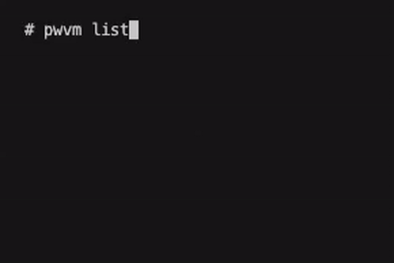

# pwvm


[](https://www.npmjs.com/package/pwvm)

### **Playwright Version Manager**

A simple *Playwright Version Manager* that solves a common pain point:

> Uncontrolled Playwright upgrades and breaking changes disrupt local setups and CI pipelines.

`pwvm` lets you install, manage, and switch Playwright versions reliably — **one command, predictable behavior**, just like `nvm` for Node.js.


---

## Why pwvm

Playwright evolves fast. That’s great — until a minor upgrade breaks tests you didn’t plan to touch.

`pwvm` keeps Playwright versions:

* isolated per version
* explicit and reproducible
* easy to switch locally and in CI

You upgrade **when you choose**, not when your tooling surprises you.

---

## Install

```sh
npm install -g pwvm
```

Then run the one-time setup:

```sh
pwvm setup
```

Follow the printed instructions to add pwvm shims to your `PATH`.

---

## Common usage

```sh
pwvm install 1.57.0
pwvm use 1.57.0
playwright --version
playwright test
```



Pin versions per project with `.pwvmrc`:

```text
1.57.0
```

If a `.pwvmrc` file is present in your project root, running `pwvm use` will automatically detect and switch to that version.

```sh
pwvm use
```

### Deterministic guarantees pwvm already provides
- Playwright installed by exact version (`playwright@x.y.z`)
- Versions stored in isolated directories (`~/.pwvm/versions/<version>`)
- Browser binaries scoped per Playwright version
- `.pwvmrc` pins version per repo
- No implicit upgrades (no latest unless explicitly requested)

> [!NOTE]
> pwvm performs no background network activity and only installs software when explicitly requested.

---

### CI-friendly

`pwvm` works in GitHub Actions, Azure Pipelines, Bitbucket, and any CI where you control `PATH`.

Example usage in GitHub Actions:
```yaml
- run: npm install -g pwvm
- run: pwvm setup
- run: pwvm install 1.40.0 && pwvm use 1.40.0
- run: npx playwright test
```

### Dockerized

`pwvm` works seamlessly in Docker containers or local development.

---

## Support pwvm

`pwvm` is built and maintained independently to fix a problem many teams quietly struggle with.

If this tool saves you time, CI hours, or debugging frustration:

* ⭐ [Star the project](https://github.com/eaccmk/pwvm)
* ❤️ [Sponsor via GitHub](https://github.com/sponsors/eaccmk)
* 🔁 Share it with your team and tag #QualityWithMillan

Your support helps keep pwvm maintained and improving.

---

📘 Full documentation and contributing guide: [https://github.com/eaccmk/pwvm](https://github.com/eaccmk/pwvm)
